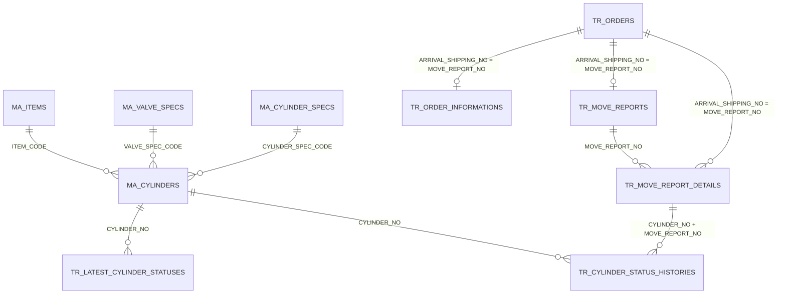
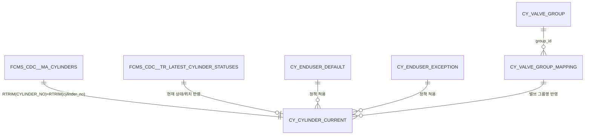

# FCMS CDC 데이터 족보 (CYNOW)

> 목적: 앞으로 기능을 추가할 때 **코드/DB를 매번 뒤지지 않고**, 이 문서만 보고  
> **어떤 CDC 테이블/컬럼을 어떤 키로 조인해야 하는지**, 데이터가 **어떻게 흘러오는지** 바로 알 수 있게 정리한다.

## 1) 큰 그림: 데이터 흐름(Flow)

### 1.1 원천 → CDC → CYNOW

- **FCMS(Oracle)** 원천 데이터
- **Debezium(또는 CDC 파이프라인)** 을 통해 PostgreSQL `fcms_cdc` 스키마로 동기화
- CYNOW는 `fcms_cdc`를 직접 조회하거나, 성능/정책 적용을 위해 **CYNOW 전용 테이블**로 가공/스냅샷한다.

### 1.2 CYNOW에서의 SSOT(사실상 기준 데이터)

- **용기 “현재 상태/속성/정책값” 기준**: `public.cy_cylinder_current`
  - 대시보드/용기목록/필터/EndUser/밸브그룹 정책이 모두 반영된 “운영용 현재값”
- **용기 “이력(기간별)” 기준**: `fcms_cdc.tr_cylinder_status_histories`
- **이동서(주문/일정/LOT/용기목록) 기준**:
  - 이동서번호(=도착출하번호): `fcms_cdc.tr_orders.ARRIVAL_SHIPPING_NO`
  - 이동서 일정/메모: `fcms_cdc.tr_order_informations`
  - 이동서 진행/LOT/확정일: `fcms_cdc.tr_move_reports`
  - 이동서에 묶인 용기 + 헤더순번 + 중량: `fcms_cdc.tr_move_report_details`

---

## 2) 매우 중요: 문자열 TRIM 규칙

FCMS의 CHAR 계열 컬럼은 **우측 공백**이 남아있는 경우가 많다.  
따라서 조인/비교는 **항상 `RTRIM/TRIM` 기준**으로 한다.

- **용기번호 키**: `RTRIM(ma_cylinders."CYLINDER_NO")` ↔ `RTRIM(cy_cylinder_current.cylinder_no)` ↔ `RTRIM(tr_*."CYLINDER_NO")`
- **이동서번호 키**: `TRIM(tr_orders."ARRIVAL_SHIPPING_NO")` ↔ `TRIM(tr_move_reports."MOVE_REPORT_NO")` ↔ `TRIM(tr_move_report_details."MOVE_REPORT_NO")` ↔ `TRIM(tr_*_histories."MOVE_REPORT_NO")`

---

## 3) 핵심 ER(관계) 요약 (Mermaid)

### 3.1 CDC 핵심 테이블 ER



### 3.2 CYNOW 파생 테이블 관계(운영 관점)



---

## 4) 테이블별 “실무 컬럼” 정리 (우리가 실제로 쓰는 것 위주)

> 전체 컬럼을 전부 나열하기보다는, **CYNOW 기능에서 반복적으로 쓰는 컬럼**을 중심으로 정리한다.

### 4.1 `fcms_cdc.ma_cylinders` (용기 마스터)

- **키**
  - `CYLINDER_NO` (PK)
- **가스/스펙**
  - `ITEM_CODE` → `fcms_cdc.ma_items.ITEM_CODE`
  - `CAPACITY`
  - `VALVE_SPEC_CODE` → `fcms_cdc.ma_valve_specs.VALVE_SPEC_CODE`
  - `CYLINDER_SPEC_CODE` → `fcms_cdc.ma_cylinder_specs.CYLINDER_SPEC_CODE`
- **중량**
  - `WEIGHT` (용기 무게, tare)
- **내압/제조**
  - `MANUFACTURE_DATE`
  - `WITHSTAND_PRESSURE_MAINTE_DATE` (내압시험일/기준일로 사용됨)
  - `WITHSTAND_PRESSURE_TEST_TERM` (년)

**사용처**
- 용기 상세/리스트 기본정보, 내압만료 계산(파생), 용기무게 표시

### 4.2 `fcms_cdc.ma_items` (가스/아이템 마스터)

- `ITEM_CODE` (PK)
- `DISPLAY_NAME`, `FORMAL_NAME`

**사용처**
- 가스명 표시(대시보드/리포트/히스토리)

### 4.3 `fcms_cdc.tr_latest_cylinder_statuses` (용기 최신 상태)

- `CYLINDER_NO` (PK에 준함)
- `CONDITION_CODE` (상태 코드)
- `MOVE_DATE` (현재 상태로 바뀐 시각)
- `POSITION_USER_NAME` (현재 위치 사용자명/로케이션 텍스트)
- `MOVE_REPORT_NO` (현재 상태가 어떤 이동서와 연결인지)

**사용처**
- `cy_cylinder_current` 생성/갱신의 핵심 입력

### 4.4 `public.cy_cylinder_current` (CYNOW 운영용 “현재값”)

> DDL/정책/갱신 원리는 `docs/CYNOW_DATA_ARCHITECTURE.md`도 함께 참고.

- **키**
  - `cylinder_no` (PK)
- **운영용 표준화 값**
  - `dashboard_gas_name`, `dashboard_capacity`
  - `dashboard_valve_spec_name`, `dashboard_valve_group_name`
  - `dashboard_cylinder_spec_name`
  - `dashboard_status` (예: 보관:미회수/충전중/분석완료/제품/출하/정비대상/폐기…)
  - `dashboard_enduser`
- **집계 키**
  - `cylinder_type_key` (dashboard 값 기반 해시)
- **내압/진단**
  - `pressure_expire_date`, `needs_fcms_fix`
- **메타**
  - `last_event_at`, `snapshot_updated_at`, `source_updated_at`

**사용처**
- 대시보드 카드/모달, 용기 목록/필터, “현재 재고” 성격의 화면

### 4.5 `fcms_cdc.tr_cylinder_status_histories` (용기 상태 이력)

- **키/정렬**
  - `CYLINDER_NO`
  - `HISTORY_SEQ` (최신/정렬에 활용)
  - `MOVE_DATE` (이동 시각)
- **이동**
  - `MOVE_CODE` (예: 10 입하, 22 충전완료, 42 분석완료, 50 창입(제품), 60 출하…)
  - `MOVE_REPORT_NO` (이동서 번호)
- **LOT**
  - 제조LOT: `MANUFACTURE_LOT_HEADER` + `MANUFACTURE_LOT_NO` + (`-MANUFACTURE_LOT_BRANCH`)
  - 충전LOT: `FILLING_LOT_HEADER` + `FILLING_LOT_NO` + (`-FILLING_LOT_BRANCH`)
- **중량**
  - `FILLING_WEIGHT` (충전 가스무게, net) — 상황에 따라 갱신될 수 있음(충전완료/분석완료/출하전 확정 등)

**사용처**
- 히스토리(입출하/충전), 리포트(일/주/월), LOT/중량 조회

### 4.6 `fcms_cdc.tr_orders` (이동서/주문: “이동서번호의 근원”)

- `ARRIVAL_SHIPPING_NO` = 이동서번호(핵심)
- `CUSTOMER_ORDER_NO` (PO/고객발주번호)
- `SUPPLIER_USER_NAME` (고객사명)
- `TRADE_CONDITION_CODE` (**제품코드 KFxxx** — 제품재고/판매의 기준 키)
- `ITEM_NAME`, `PACKING_NAME`
- `INSTRUCTION_COUNT` (지시수량=병수)
- `DELIVERY_DATE` 등

**사용처**
- 수주(orders) 화면, 제품 재고(제품코드), 이동서 헤더 표시

### 4.7 `fcms_cdc.tr_order_informations` (이동서 일정/메모)

- 조인키: `MOVE_REPORT_NO` (= `ARRIVAL_SHIPPING_NO`)
- 일정:
  - `FILLING_PLAN_DATE` (충전예정)
  - `WAREHOUSING_PLAN_DATE` (창입예정)
  - `SHIPPING_PLAN_DATE` (출하예정)
- 메모: `SALES_REMARKS`, `BUSINESS_REMARKS`, `PRODUCTION_REMARKS`

**사용처**
- 대시보드 이동서 모달 “예정일” 표시, 수주 진행표

### 4.8 `fcms_cdc.tr_move_reports` (이동서 진행/확정일/LOT)

- 조인키: `MOVE_REPORT_NO` (= `ARRIVAL_SHIPPING_NO`)
- 확정일:
  - `FILLING_DATE` (충전 확정일)
  - `SHIPPING_DATE` (출하 확정일)
- 충전LOT(이동서 단위):
  - `FILLING_LOT_HEADER` + `FILLING_LOT_NO` + (`-FILLING_LOT_BRANCH`)
- `PROGRESS_CODE` (취소 등 상태코드)

**사용처**
- 대시보드 이동서 모달 “확정일/LOT”, 수주 진행표

### 4.9 `fcms_cdc.tr_move_report_details` (이동서에 묶인 용기 + 헤더순서 + 중량)

- 조인키:
  - `MOVE_REPORT_NO`
  - `CYLINDER_NO`
- **헤더순서(현장 바코드 스캔/정렬 핵심)**
  - `ROW_NO` (문서에서 말하는 “헤더번호/순서”로 사용)
- **중량**
  - `CYLINDER_WEIGHT` (tare)
  - `FILLING_WEIGHT` (net)

**사용처**
- 이동서별 용기현황(정렬/중량/충전무게), 이동서 상세(orders 모달)

---

## 5) LOT 문자열 구성 규칙(표준)

### 5.1 제조LOT

```text
manufacture_lot =
  MANUFACTURE_LOT_HEADER + MANUFACTURE_LOT_NO + ( '-' + MANUFACTURE_LOT_BRANCH ? )
```

### 5.2 충전LOT

```text
filling_lot =
  FILLING_LOT_HEADER + FILLING_LOT_NO + ( '-' + FILLING_LOT_BRANCH ? )
```

> 참고: 충전조회(/history/charge/)에서도 위 규칙으로 조합하여 보여준다(HistoryRepository 기준).

---

## 6) 중량(무게) 해석 규칙(표준)

용기 중량은 보통 다음처럼 해석한다:

- **Tare(용기무게)**: `tr_move_report_details.CYLINDER_WEIGHT` (있으면 우선), 없으면 `ma_cylinders.WEIGHT`
- **Net(가스무게/충전무게)**: `tr_move_report_details.FILLING_WEIGHT` 우선, 없으면 `tr_cylinder_status_histories.FILLING_WEIGHT`
- **Gross(총중량)**: `tare + net` (표시만, 원천 컬럼이 없을 수도 있음)

---

## 7) 상태/이동 코드(운영 관점)

### 7.1 CONDITION_CODE → CYNOW dashboard_status (예: sync 함수 기준)

- `100`/`00` → 보관:미회수
- `102` → 보관:회수
- `210` → 충전중
- `220` → 충전완료
- `410` → 분석중
- `420` → 분석완료
- `500` → 제품
- `600` → 출하
- `190` → 이상
- `950`/`952` → 정비대상
- `990` → 폐기

> 실제 매핑은 `sql/update_sync_function_pressure.sql` 및 `core/utils/status_mapper.py`를 기준으로 한다.

### 7.2 MOVE_CODE (이동 이벤트) — 리포트/히스토리 기준

리포트에서 주로 사용하는 예:

- `10` 입하
- `22` 충전완료
- `41` 분석중
- `42` 분석완료
- `50` 창고입고(=제품 상태로 이어짐)
- `60` 출하

---

## 8) “자주 쓰는 조인 레시피” (실전용)

### 8.1 “현재 상태” + “스펙/내압/정책” 한번에

- 기준: `cy_cylinder_current` (이미 조인/정책이 반영됨)
- 부족한 값(예: raw 디테일)이 필요하면 `fcms_cdc.ma_cylinders`를 `RTRIM`으로 조인

### 8.2 “기간 이력(이동/LOT/중량)” 조회

- 기준: `fcms_cdc.tr_cylinder_status_histories h`
- 조인:
  - `LEFT JOIN cy_cylinder_current c ON RTRIM(h.CYLINDER_NO)=RTRIM(c.cylinder_no)`
  - `LEFT JOIN fcms_cdc.tr_move_report_details d ON RTRIM(h.CYLINDER_NO)=RTRIM(d.CYLINDER_NO) AND RTRIM(h.MOVE_REPORT_NO)=RTRIM(d.MOVE_REPORT_NO)`

### 8.3 “이동서(주문) 헤더 + 일정 + LOT + 용기리스트”

- 헤더(주문): `tr_orders o` (키: `ARRIVAL_SHIPPING_NO`)
- 일정: `tr_order_informations oi` (키: `MOVE_REPORT_NO`)
- 진행/확정/LOT: `tr_move_reports m` (키: `MOVE_REPORT_NO`)
- 용기 목록/헤더순서/중량: `tr_move_report_details d` (키: `MOVE_REPORT_NO`)
- 용기별 현재 이력: 필요시 `tr_cylinder_status_histories`에서 LATERAL로 최신 1건

### 8.4 제품 재고(판매/거래명세서 기준)

- 제품 재고의 기준 키는 `cylinder_type_key`가 아니라 **`tr_orders.TRADE_CONDITION_CODE`(KFxxx)**  
- 창입(제품) 상태의 용기들을 이동서와 연결하여 **KFxxx별 병수**를 집계한다.

---

## 9) 문서 유지 원칙(운영 규칙)

- 기능 추가 시:
  - 새로 사용한 **CDC 테이블/컬럼/조인 키**가 있으면 본 문서에 추가
  - “왜 이 컬럼이 필요했는지(화면/기능)” 1줄 메모 추가
- “테이블 전체 컬럼 리스트”는 목표가 아니다.
  - **우리 코드가 의존하는 컬럼/조인/규칙**이 핵심이다.

---

## 10) 참고 문서

- `docs/CDC_TABLES_ANALYSIS.md` (CDC 테이블 구조/의미 개요)
- `docs/CYNOW_DATA_ARCHITECTURE.md` (cy_cylinder_current 등 CYNOW 파생 테이블/정책/동기화 설계)
- `sql/create_cy_cylinder_current.sql`, `sql/update_sync_function_pressure.sql` (동기화/매핑 로직)


